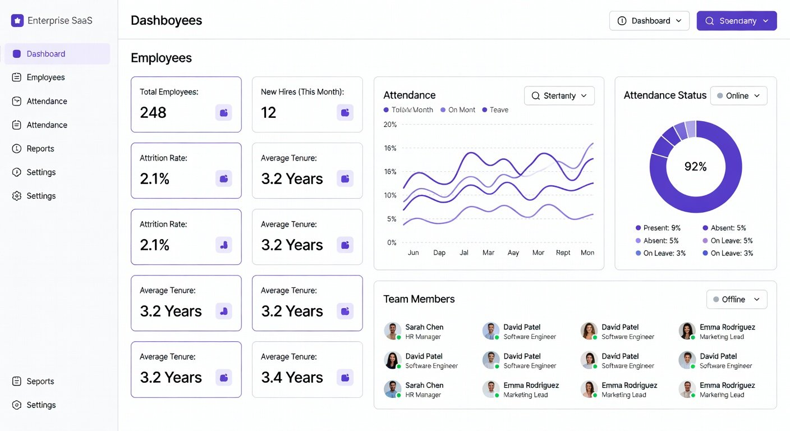

# DMS-HRMS - Human Resource Management System

A modern, high-performance Full-Stack Human Resource Management System (HRMS) built with **FastAPI**, **MongoDB Atlas**, and **React**.



## 🚀 Features

- **Employee Management**: Full CRUD directory with Grid, List, and Kanban views.
- **Bulk Import**: Drag-and-drop import for JSON, CSV, and Excel (.xlsx) files.
- **Kanban Grouping**: Drag-and-drop employees between departments with automatic database sync.
- **Role-Based Access**: Specialized views and permissions for Admins, Managers, and Employees.
- **Cloud Database**: Integrated with MongoDB Atlas for global scalability and data persistence.
- **Modern UI**: Built with Tailwind CSS, Lucide Icons, and Framer Motion for a premium, responsive experience.

## 🛠️ Tech Stack

- **Backend**: Python 3.10+, FastAPI, Motor (Async MongoDB), Pydantic.
- **Frontend**: React 18, TypeScript, Vite, Tailwind CSS, Hello Pangea DND.
- **Database**: MongoDB Atlas (Cloud).
- **Authentication**: JWT (JSON Web Tokens) with Python-Jose.

## 📁 Project Structure

```text
DMS-HRMS/
├── backend/            # Python FastAPI backend
│   ├── auth.py         # JWT & Password logic
│   ├── database.py     # MongoDB connection
│   ├── main.py         # API Endpoints
│   └── seed_users.py   # Demo data script
├── frontend/           # React TypeScript frontend
│   ├── src/            # Application source
│   ├── public/         # Static assets
│   └── vite.config.ts  # Build configuration
└── .env                # Environment variables (Database URL, Secret Keys)
```

## ⚙️ Getting Started

### 1. Prerequisites
- Python 3.10+
- Node.js 18+
- MongoDB Atlas account (or local MongoDB)

### 2. Setup Backend
```bash
# Install dependencies
pip install -r backend/requirements.txt

# Start the server
$env:PYTHONPATH="."; python -m uvicorn backend.main:app --reload
```

### 3. Setup Frontend
```bash
cd frontend
npm install
npm run dev
```

### 4. Demo Access
Use the following credentials for the demo:
- **Admin**: `admin@dms.com` / `admin123`
- **Manager**: `manager@dms.com` / `manager123`
- **Employee**: `employee@dms.com` / `employee123`

## 🤝 Contribution

Contributions are welcome! Please feel free to submit a Pull Request.

---
Developed by **Himanshu**
